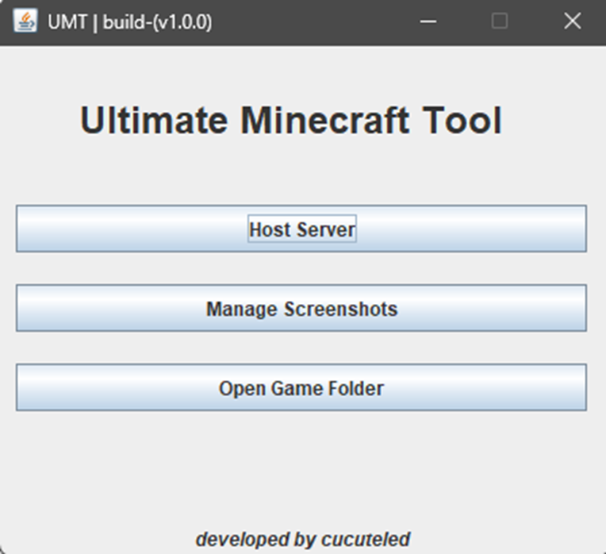
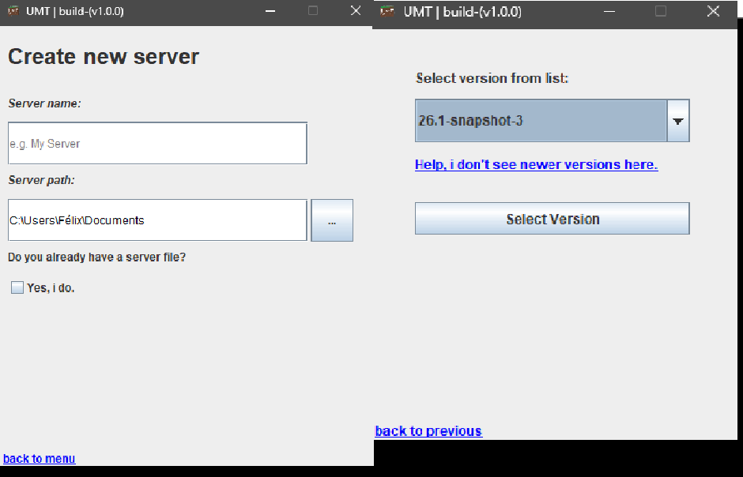
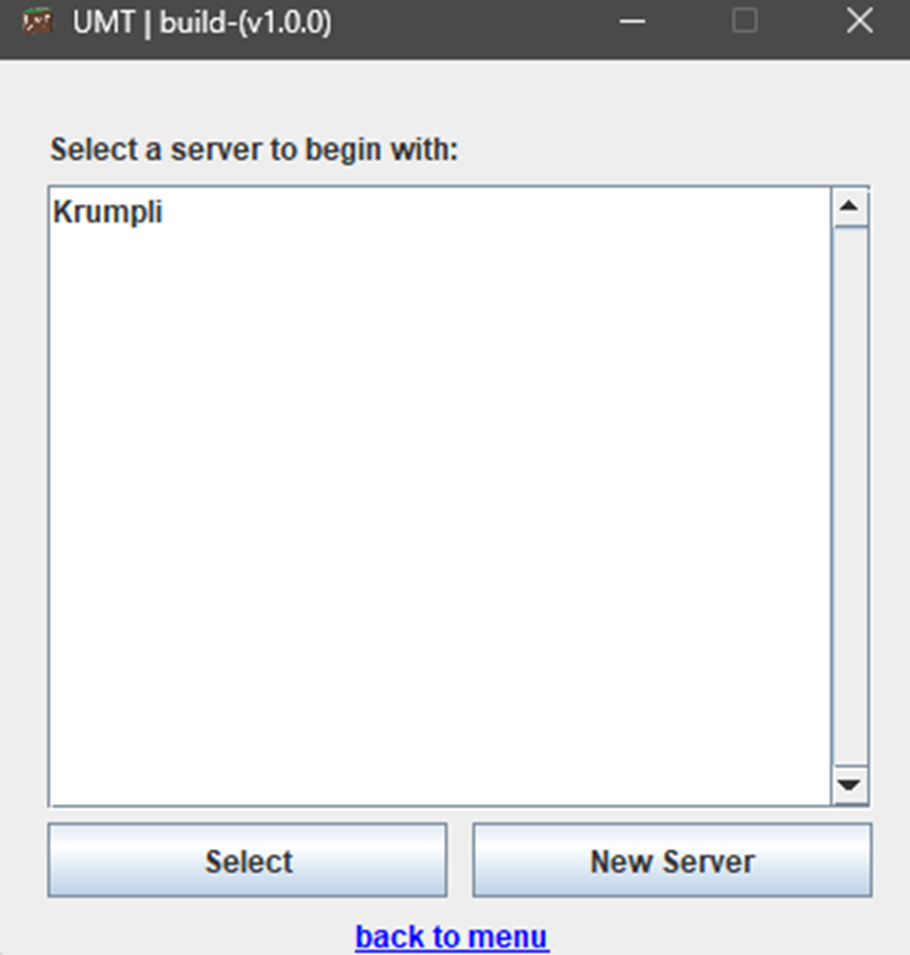
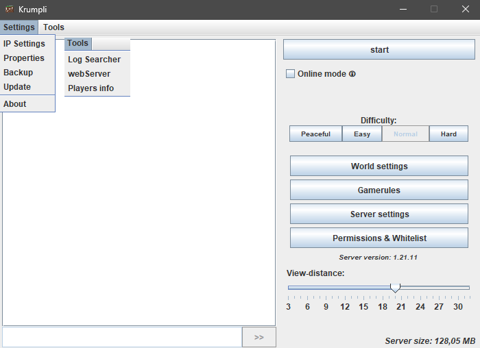

# Ultimate Minecraft Tool (UMT)

---

## 🌍 Overview

**Ultimate Minecraft Tool (UMT)** is a lightweight toolkit for creating, managing, and controlling Minecraft servers using only the Java Standard SDK.  
It is designed for performance ⚡, portability 🌐, and transparency 🔎 without relying on external libraries.

The application includes **programmatically constructed JFrame components**, meaning the interface is built entirely in code (no GUI builders), ensuring full control, cleaner logic, and easier customization.  
The goal is to distribute the entire tool as a **single runnable `.jar` file** ▶ that works out of the box.

 

---

## 🎯 Project Goal

The goal of this project is to provide a complete server management solution that is:

- 📦 Dependency-free  
- 🪶 Lightweight  
- 🌍 Portable  
- 🛠 Easy to modify 

---

## 🧰 Features

### 📸 Screenshot Manager
Just for idk.

### ⬇️ Mojang Server Downloader
Download official server files directly from the Mojang API.

### 🚀 Server Initialization
Automatically prepares a server environment:
- folder structure  
- configuration files  
- runtime setup  

### ⚙️ Properties Manager
Safely read and modify `server.properties`.

### 🧬 Simple NBT Parser
Basic parser for Minecraft's Named Binary Tag format.

---

## 🔮 Planned Features

### 🌐 Authenticated Web Server
A built-in web interface with authentication that allows remote monitoring and control.

### 🕹 Remote Server Control
Start or stop the server remotely through a browser or API.
Players can fetch their data visually on web.

### ⏱ Idle Auto Shutdown
Stops the server automatically after **6 minutes of inactivity** to save resources.

---

## 🧠 Design Principles

- Pure Java SDK only ☕   
- Modular design 🧩  
- Beginner & developer friendly 🤝  

---

## ▶ Example Usage

Build the jar and run it.
